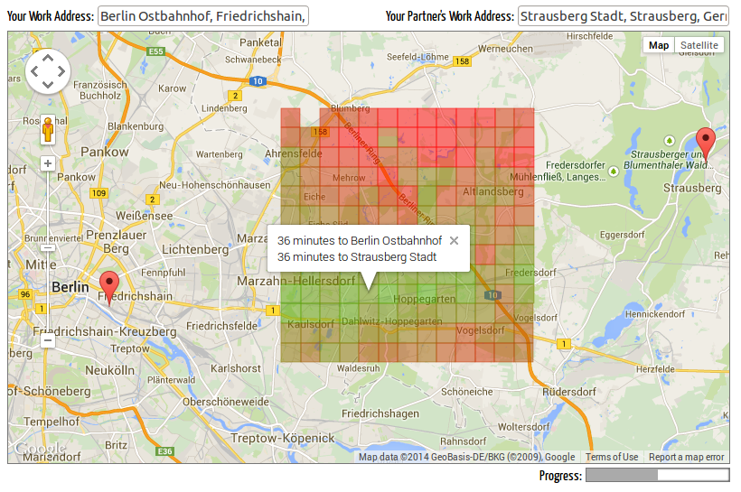

commuter
========

Maps-driven Browser App to Find the Best Place to Live for Commuters

# About

Commuting to work can be a time-consuming process. This tiny browser-app helps
you to minimize the time you spent on public transport for both you and your
partner. Just enter both of your work addresses and the application analyzes
areas in the vicinity for their transit time. Regions with high transit time
for one or both of you are shaded in red whereas regions with low transit time
for both of you are shaded in green.

Please note that due to Google Maps' quota restrictions, the application will
generally be slow to calculate transit times. Most of the time the program
will just sit idle and wait for the Google Maps API to return another
directions result.

